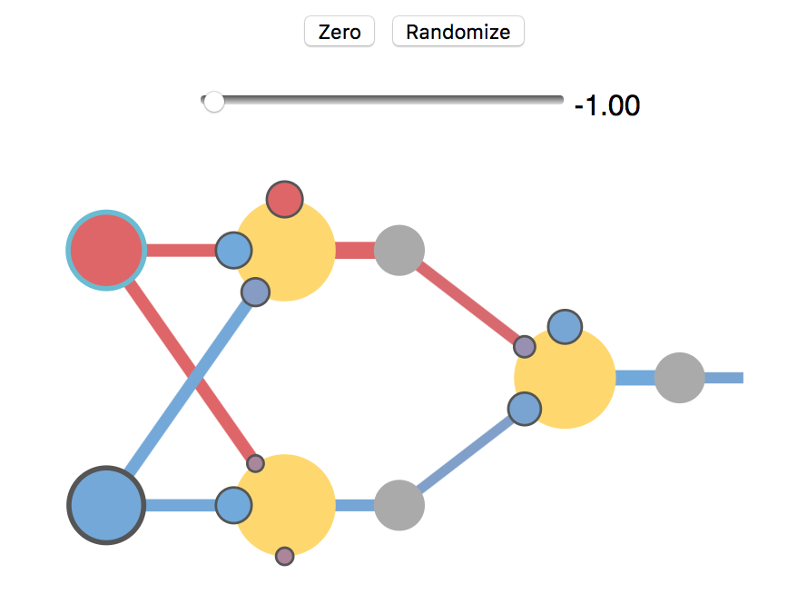

# visualnet

This is a set of visualizations for artificial neural networks. Try the demo yourself at [htmlpreview.github.com](http://htmlpreview.github.io/?https://github.com/unixpickle/visualnet/blob/master/network/index.html).

